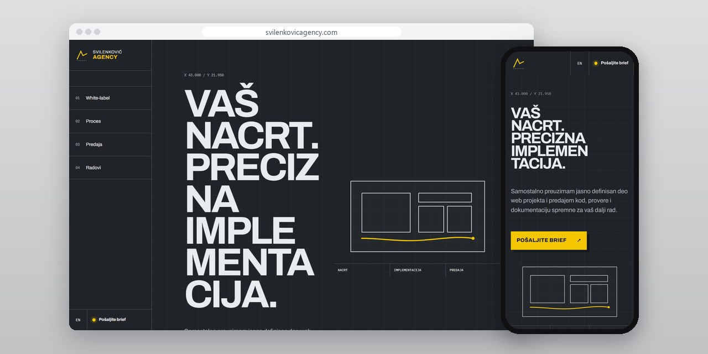
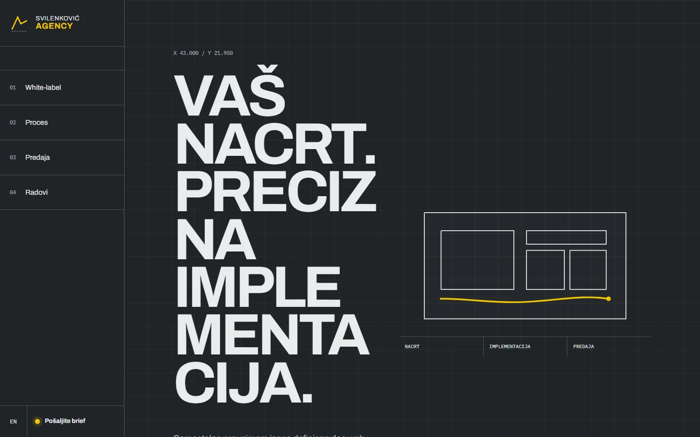
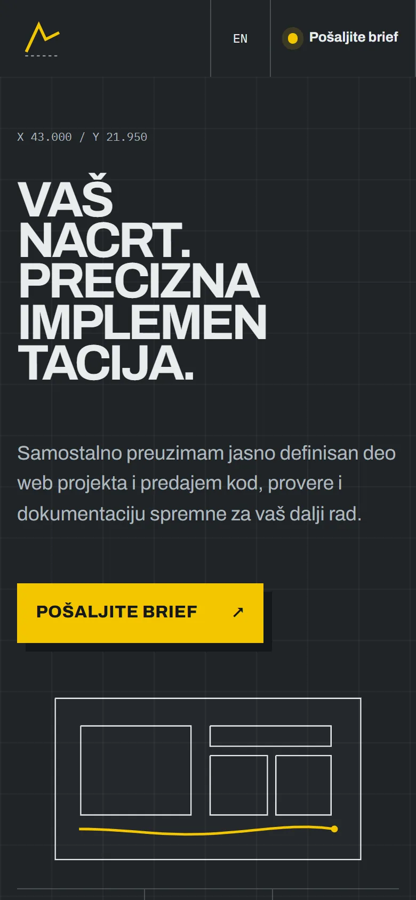
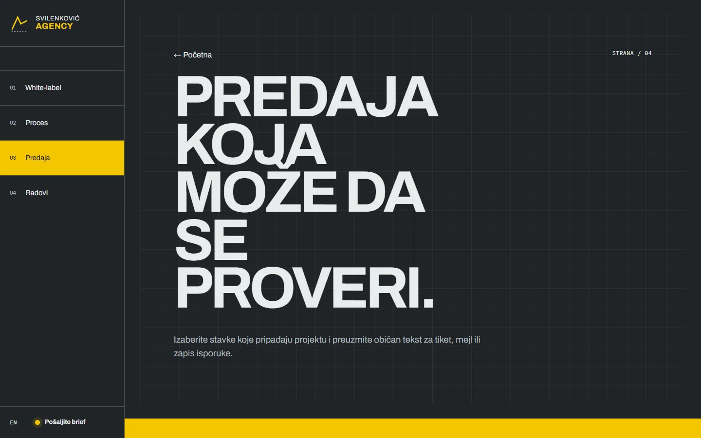

# Svilenković Agency

Sajt za studije i agencije kojima treba neko da izradi i objavi odobren dizajn, uz listu predaje koju druga strana može da proveri.

**[svilenkovicagency.com](https://svilenkovicagency.com/)** · [Studija slučaja](https://svilenkovic.rs/radovi/svilenkovic-agency) · [English](README.md)

> [!NOTE]
> Moj sopstveni projekat, ne klijentski posao. Izvorni kod je privatan. Ova stranica opisuje šta sajt radi i kako je napravljen.

<table>
  <tr><td><b>Klijent</b></td><td>Sopstveni projekat</td></tr>
  <tr><td><b>Delatnost</b></td><td>Izrada za dizajnere i agencije</td></tr>
  <tr><td><b>Lokacija</b></td><td>Srbija</td></tr>
  <tr><td><b>Vrsta</b></td><td>Sajt sa više strana</td></tr>
  <tr><td><b>Moj deo posla</b></td><td>Istraživanje, dizajn, izrada, SEO i hosting</td></tr>
  <tr><td><b>Tehnologije</b></td><td>Astro 7, TypeScript, PHP 8.3, SQLite, nginx</td></tr>
</table>

## O projektu

Partner koji predaje web posao treba da zna gde se završava dizajn, gde počinje izrada i šta će moći da proveri pri predaji. Svilenković Agency taj odnos prikazuje kao tehnički crtež koji se postepeno pretvara u gotov interfejs. Vizuelna osnova može da bude precizna, a da ništa ne kaže o prikazu na telefonu, formama, starim adresama ili pristupačnosti.

Strana Predaja izdvaja stavke koje druga strana može sama da proveri, pa ostaje manje prostora za neodređeno „završeno je“. Javni radovi prikazani su kao moji projekti i kao primeri obima. Nisam ih predstavio kao skrivene white-label poslove ni kao rad tuđe agencije, jer je ta granica važna za pošten prikaz saradnje.

## Šta sam uradio

- Put od odobrenog dizajna do izdanja koje radi
- Strana Predaja sa stavkama koje naručilac ili partner mogu da provere
- Strane o procesu, white-label saradnji i studija o EVROCERT-u
- Pokret u stilu plotera, sa kraćom verzijom za male ekrane
- Obim se određuje iz stvarnog zadatka, bez javnih cenovnih paketa

## Merenja

| | Performanse | Pristupačnost | Dobre prakse | SEO |
| :-- | :-: | :-: | :-: | :-: |
| Telefon | 100 | 100 | 100 | 100 |
| Desktop | 100 | 100 | 100 | 100 |

PageSpeed Insights, laboratorijsko merenje živog sajta, oktobar 2026. Sigurnosna zaglavlja: 6 od 6. axe provera pristupačnosti: bez prekršaja. Strukturisani podaci: `Organization`, `Person`.

## Snimci ekrana

<table>
  <tr>
    <td width="68%" valign="top"></td>
    <td width="32%" valign="top"></td>
  </tr>
</table>

Predaja na živom sajtu

---

Izrada: [D. Svilenković](https://svilenkovic.rs).
